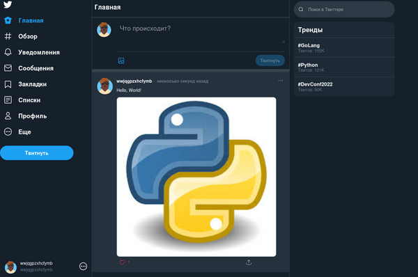

<h1 align="center">Twitter-Clone</h1>

## 📦 Установка

### 📰 Скопируйте проект

```
git clone https://gitlab.com/sashapenkin12/fastapi-twitter-clone.git
```

## 🏃‍♂️ Запуск

### Скачайте Docker. (если не установлен)

#### Сделать это можно [здесь](https://www.docker.com/products/docker-desktop/)

### Затем:

```
docker compose up --build
```

### 🔴Использование

После запуска перейдите на:

http://127.0.0.1 или http://0.0.0.0 — веб-интерфейс

http://127.0.0.1:8000/docs — Swagger-документация API

### 📕Возможности

✍️ Пост твита с текстом и файлами

❤️ Лайки (добавление и удаление)

➕ Подписка на пользователя

➖ Отписка от пользователя

## 📸 Скриншоты

| Главная страница                      | Создание твита                          |
|---------------------------------------|-----------------------------------------|
|  |  |

## 🚀 Демо
🚧 Временно недоступно. Планируется деплой на Render/VPS.


### 💻 Используемые технологии

#### Backend (FastAPI)

- ⚡ FastAPI — высокопроизводительный фреймворк

- 💾 PostgreSQL — реляционная база данных

- 🔍 Pydantic — валидация входных данных

- 🧮 SQLAlchemy (async) — ORM для работы с БД

- ✅ Pytest — для тестирования

- 🐳 Docker — контейнеризация и изоляция

#### - 🐦Vue.js: для фронтенда на JS

- Vue.js
- Vue Router
- Vuex
- axios-mock-adapter (for fake REST API)

#### - 🐋Docker Compose: для разработки и производства.

#### - ✅Pytest: для тестирования


### 📬 Контакты

GitHub: github.com/sashapenkin12

Email: sashapenkin12@mail.ru

Telegram: @slient19
